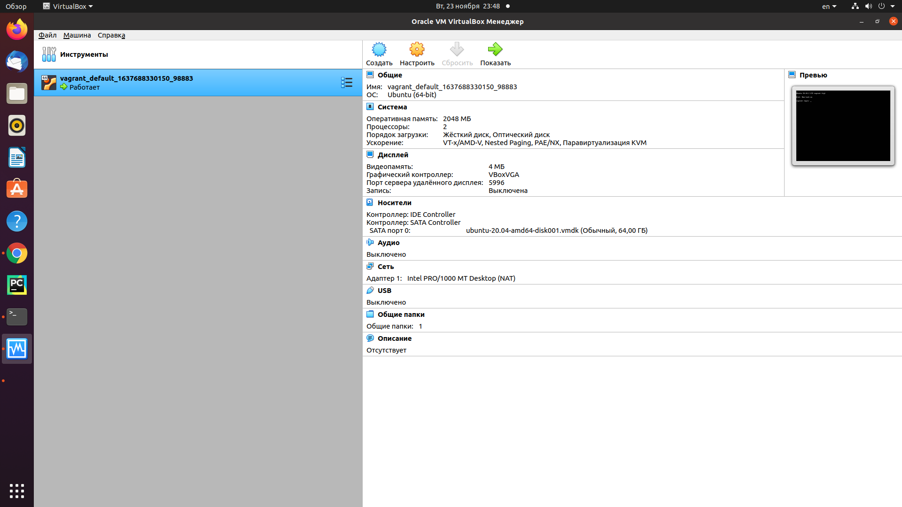

## Домашнее задание к занятию "3.1. Работа в терминале, лекция 1"

1. Установите средство виртуализации [Oracle VirtualBox](https://www.virtualbox.org/).

    -  *Выполнено*

1. Установите средство автоматизации [Hashicorp Vagrant](https://www.vagrantup.com/).

    -  *Выполнено*

1. В вашем основном окружении подготовьте удобный для дальнейшей работы терминал.

    -  *Выполнено*

1. С помощью базового файла конфигурации запустите Ubuntu 20.04 в VirtualBox посредством Vagrant.

    -  *Выполнено*

1. Ознакомьтесь с графическим интерфейсом VirtualBox, посмотрите как выглядит виртуальная машина, которую создал для вас Vagrant, какие аппаратные ресурсы ей выделены. Какие ресурсы выделены по-умолчанию?

    

    - *2 ядра*
   
    - *1 Гб оперативной памяти*  (на скриншоте уже измененная конфигурация с добавлением памяти)
   
    - *64 Гб места в автоматически расширяемом файле*
   
    - *сетевой адаптер, настроен на доступ используя NAT*
   
    - *видеопамяти 4 Мб.*
   

1. Ознакомьтесь с возможностями конфигурации VirtualBox через Vagrantfile: [документация](https://www.vagrantup.com/docs/providers/virtualbox/configuration.html). Как добавить оперативной памяти или ресурсов процессора виртуальной машине?

    - *Изменив Vagrantfile*  

    ```
    config.vm.provider "virtualbox" do |v|  
        v.memory = 1024 #количество памяти  
        v.cpus = 2 #количество ядер
    end
    ```

2. Команда `vagrant ssh` из директории, в которой содержится Vagrantfile, позволит вам оказаться внутри виртуальной машины без каких-либо дополнительных настроек. Попрактикуйтесь в выполнении обсуждаемых команд в терминале Ubuntu.

    -  *Выполнено*

3. Ознакомиться с разделами `man bash`, почитать о настройках самого bash:
    * какой переменной можно задать длину журнала `history`, и на какой строчке manual это описывается?  

    *Переменная HISTSIZE, строка мануала 627*

    * что делает директива `ignoreboth` в bash?  

    *В переменной HISTCONTROL указывает не сохранять команды, начатые с пробела и не сохранять повторно введенные команды*

4. В каких сценариях использования применимы скобки `{}` и на какой строчке `man bash` это описано?

    `{ список_команд; }`

    *В скриптах*

    *185 строка мануала*

     *Как brace expansion для формирования строк, содержащих последовательные символы.*

    `$ echo {000000..300000}`

    *Выводит последовательный список чисел от 000000 до 300000 через пробел.*  
    *806 строка мануала*

6. Основываясь на предыдущем вопросе, как создать однократным вызовом `touch` 100000 файлов? А получилось ли создать 300000? Если нет, то почему?

    `$ touch {000000..100000}`

    *С параметрами по умолчению - нельзя.*

    >bash: /usr/bin/touch: Argument list too long

    *Можно создать 300000 файлов, если увеличить стек shell*

    `$ ulimit -s`

7. В man bash поищите по `/\[\[`. Что делает конструкция `[[ -d /tmp ]]`

    *Возвращает 1, если существует файл /tmp и это директория*

    `$ if [[ -d /tmp ]]; then echo 1; else echo 0; fi`

    >1

8. Основываясь на знаниях о просмотре текущих (например, PATH) и установке новых переменных; командах, которые мы рассматривали, добейтесь в выводе type -a bash в виртуальной машине наличия первым пунктом в списке:

    `$ mkdir /tmp/new_path_directory`  
    `$ ln -s /usr/bin/bash /tmp/new_path_directory/bash`  
    `$ PATH=/tmp/new_path_directory:$PATH`  
    `$ type -a bash`

    >bash is /tmp/new_path_directory/bash  
    >bash is /usr/bin/bash  
    >bash is /bin/bash

9. Чем отличается планирование команд с помощью `batch` и `at`?

    *Команды `batch` и `at` предназначены для однократного выполнения заданий.*  
    - *`at` для выполнения задания в назначенное время*  
    -  *`batch` для выполнения заданий, когда средняя загрузка системы упадет ниже 1.5. Можно изменить в 'atd'*

10. Завершите работу виртуальной машины чтобы не расходовать ресурсы компьютера и/или батарею ноутбука.

     `vagrant halt`

    - *Выполнено*