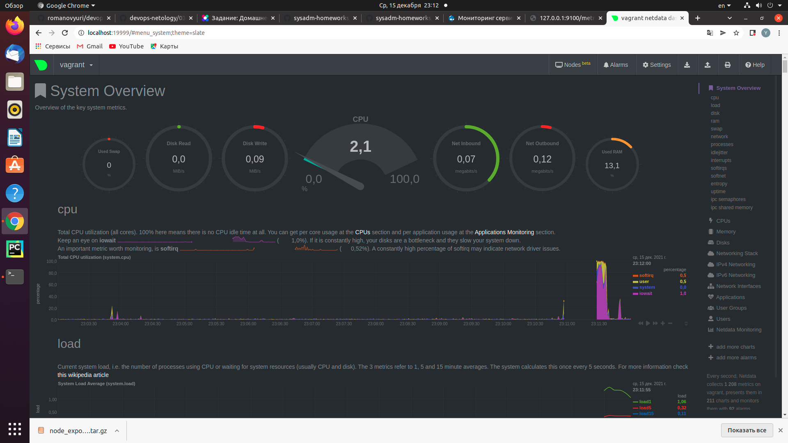

# Домашнее задание к занятию "3.4. Операционные системы, лекция 2"


1. На лекции мы познакомились с [node_exporter](https://github.com/prometheus/node_exporter/releases). В демонстрации его исполняемый файл запускался в background. Этого достаточно для демо, но не для настоящей production-системы, где процессы должны находиться под внешним управлением. Используя знания из лекции по systemd, создайте самостоятельно простой [unit-файл](https://www.freedesktop.org/software/systemd/man/systemd.service.html) для node_exporter:
    
    `$ systemctl cat node_exporter`

    ```
    # /lib/systemd/system/node_exporter.service
    [Unit]
    Description=Node exporter
    Documentation=https://prometheus.io/docs/guides/node-exporter/
    After=remote-fs.target nss-user-lookup.target

    [Service]
    EnvironmentFile=/etc/default/node_exporter
    ExecStart=/usr/local/bin/node_exporter $EXTRA_OPTS
    IgnoreSIGPIPE=false
    KillMode=process
    Restart=on-failure

    [Install]
    WantedBy=multi-user.target
    ```
    * поместите его в автозагрузку,

    `$ systemctl enable node_exporter`

    * предусмотрите возможность добавления опций к запускаемому процессу через внешний файл (посмотрите, например, на `systemctl cat cron`),

    *Предусмотрено в файле `/etc/default/node_exporter`*

    * удостоверьтесь, что с помощью systemctl процесс корректно стартует, завершается, а после перезагрузки автоматически поднимается.

    `$ systemctl start node_exporter`
     
     `$ systemctl stop node_exporter`
 
     `$ systemctl restar node_exporter`   

3. Ознакомьтесь с опциями node_exporter и выводом `/metrics` по-умолчанию. Приведите несколько опций, которые вы бы выбрали для базового мониторинга хоста по CPU, памяти, диску и сети.

    `node_cpu_seconds_total`  
    `node_disk_io_time_seconds_total`  
    `node_filesystem_avail_bytes`  
    `node_memory_MemAvailable_bytes`  
    `node_network_receive_bytes_total`  
    `node_network_receive_packets_total`  
    `node_network_transmit_bytes_total`  
    `node_network_transmit_packets_total`

4. Установите в свою виртуальную машину [Netdata](https://github.com/netdata/netdata). Воспользуйтесь [готовыми пакетами](https://packagecloud.io/netdata/netdata/install) для установки (`sudo apt install -y netdata`). После успешной установки:
    
    

    *Выполнено*

5. Можно ли по выводу `dmesg` понять, осознает ли ОС, что загружена не на настоящем оборудовании, а на системе виртуализации?

    *Можно*
   
    `$ dmesg | grep 'virtual'`

    ```
            vagrant@vagrant:~$ dmesg | grep 'virtual'
            [     0.002909] CPU MTRRs all blank - virtualized system.
            [    0.087242] Booting paravirtualized kernel on KVM
            [    4.319351] systemd[1]: Detected virtualization oracle.

    ```

    
    
6. Как настроен sysctl `fs.nr_open` на системе по-умолчанию? Узнайте, что означает этот параметр. Какой другой существующий лимит не позволит достичь такого числа (`ulimit --help`)?

    `$ sysctl -n fs.nr_open`

    `1048576`

    *означает максимальное количество файловых дескрипторов, которые могут быть открыты процессом*

   

7. Запустите любой долгоживущий процесс (не `ls`, который отработает мгновенно, а, например, `sleep 1h`) в отдельном неймспейсе процессов; покажите, что ваш процесс работает под PID 1 через `nsenter`. Для простоты работайте в данном задании под root (`sudo -i`). Под обычным пользователем требуются дополнительные опции (`--map-root-user`) и т.д.

    `# unshare -f -p --mount-proc sleep 1h`

    *С другой консоли*

    `# nsenter --target PID --pid --mount`  
    `# ps aux`

    ```
    USER         PID %CPU %MEM    VSZ   RSS TTY      STAT START   TIME COMMAND
    root           1  0.0  0.0   9828   588 pts/0    S+   15:49   0:00 sleep 1h
    root           2  0.0  0.3  11560  3844 pts/1    S    15:51   0:00 -bash
    root          11  0.0  0.3  13216  3284 pts/1    R+   15:51   0:00 ps aux
    ```

8. Найдите информацию о том, что такое `:(){ :|:& };:`. Запустите эту команду в своей виртуальной машине Vagrant с Ubuntu 20.04 (**это важно, поведение в других ОС не проверялось**). Некоторое время все будет "плохо", после чего (минуты) – ОС должна стабилизироваться. Вызов `dmesg` расскажет, какой механизм помог автоматической стабилизации. Как настроен этот механизм по-умолчанию, и как изменить число процессов, которое можно создать в сессии?

    *Это fork bomb*

    `$ :(){ :|:& };:`

    *После стабилизации*

    `$ dmesg`

    `[ 1340.710618] cgroup: fork rejected by pids controller in /user.slice/user-1000.slice/session-7.scope

    `$ ulimit -u`

    `3571`

    *Изменить лимиты в файле*
 
    `/etc/security/limits.conf`