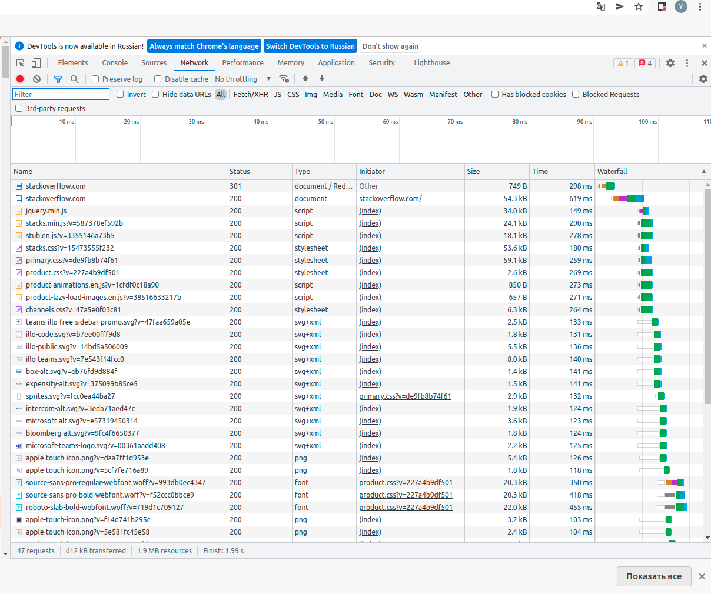

# Домашнее задание к занятию "3.6. Компьютерные сети, лекция 1"


1. Работа c HTTP через телнет.
- Подключитесь утилитой телнет к сайту stackoverflow.com
- В ответе укажите полученный HTTP код, что он означает?

    >HTTP/1.1 301 Moved Permanently

    *Код 301 означает, что страница была перемещена на другой адрес, подробности в поле location*

    >location: https://stackoverflow.com/questions

2. Повторите задание 1 в браузере, используя консоль разработчика F12.
- откройте вкладку `Network`
- отправьте запрос http://stackoverflow.com
- найдите первый ответ HTTP сервера, откройте вкладку `Headers`
- укажите в ответе полученный HTTP код.

    ```
    HTTP/1.1 307 Internal Redirect
    Location: https://stackoverflow.com/
    Non-Authoritative-Reason: HSTS
    ```

- проверьте время загрузки страницы, какой запрос обрабатывался дольше всего?

    *Время загрузки 2 секунды. Самый долгий запрос первый `https://stackoverflow.com/` - 619 ms*

- приложите скриншот консоли браузера в ответ.

    

3. Какой IP адрес у вас в интернете?

    `$ dig +short myip.opendns.com @resolver1.opendns.com`

    >185.54.238.91

4. Какому провайдеру принадлежит ваш IP адрес? Какой автономной системе AS? Воспользуйтесь утилитой `whois`

    whois -h whois.radb.net 185.54.238.91

    ```
    
     route:          185.54.238.0/23
     descr:          Sannikov Kirill Vladimirovich
     origin:         AS60245
     mnt-by:         MNT-23NET
     created:        2014-07-09T09:33:10Z
     last-modified:  2014-07-09T09:33:10Z
     source:         RIPE
     remarks:        ****************************
     remarks:        * THIS OBJECT IS MODIFIED
     remarks:        * Please note that all data that is generally regarded as personal
     remarks:        * data has been removed from this object.
     remarks:        * To view the original object, please query the RIPE Database at:
     remarks:        * http://www.ripe.net/whois
     remarks:        ****************************

    ```

5. Через какие сети проходит пакет, отправленный с вашего компьютера на адрес 8.8.8.8? Через какие AS? Воспользуйтесь утилитой `traceroute`

    ```
       traceroute to 8.8.8.8 (8.8.8.8), 30 hops max, 60 byte packets
      1  192.168.10.1 [*]  0.528 ms  0.528 ms  0.544 ms
      2  10.254.0.127 [*]  1.520 ms  1.525 ms  1.547 ms
      3  * * *
      4  217.150.53.198 [AS20485]  5.162 ms  5.178 ms  5.159 ms
      5  * * *
      6  188.43.239.130 [AS20485]  31.577 ms 188.43.239.122 [AS20485]  29.912 ms 188.43.239.130 [AS20485]  29.900 ms
      7  188.43.239.9 [AS20485]  31.646 ms  31.090 ms  30.835 ms
      8  217.150.55.234 [AS20485]  63.700 ms  45.127 ms  45.138 ms
      9  188.43.10.141 [AS20485]  48.138 ms  48.169 ms  48.204 ms
      10  108.170.250.130 [AS15169]  49.311 ms 108.170.250.146 [AS15169]  50.359 ms *
      11  142.250.239.64 [AS15169]  59.858 ms *  60.019 ms
      12  216.239.57.222 [AS15169]  55.931 ms 216.239.48.224 [AS15169]  59.099 ms 108.170.235.64 [AS15169]  62.334 ms
      13  209.85.254.179 [AS15169]  58.820 ms 172.253.51.221 [AS15169]  63.996 ms 216.239.47.173 [AS15169]  61.020 ms
      14  * * *
      15  * * *
      16  * * *
      17  * * *
      18  * * *
      19  * * *
      20  * * *
      21  * * *
      22  * * *
      23  8.8.8.8 [AS15169]  60.847 ms *  61.171 ms

    ```

   

6. Повторите задание 5 в утилите `mtr`. На каком участке наибольшая задержка - delay?

    ```
                                  My traceroute  [v0.93]
   aHOST: MyUbuntuHost                Loss%   Snt   Last   Avg  Best  Wrst StDev
      1. AS???    192.168.10.1         0.0%    10    0.5   0.5   0.4   0.6   0.0
      2. AS???    10.254.0.127         0.0%    10    1.4   1.2   0.7   2.1   0.4
      3. AS???    ???                 100.0    10    0.0   0.0   0.0   0.0   0.0
      4. AS20485  217.150.53.198       0.0%    10    2.4   2.4   1.9   2.7   0.3
      5. AS???    ???                 100.0    10    0.0   0.0   0.0   0.0   0.0
      6. AS20485  188.43.239.122       0.0%    10   29.9  30.1  29.6  31.0   0.5
      7. AS20485  188.43.239.9         0.0%    10   30.9  31.0  30.3  31.7   0.4
      8. AS20485  217.150.55.234       0.0%    10   44.5  44.5  44.0  45.1   0.4
      9. AS20485  188.43.10.141        0.0%    10   47.9  47.8  47.1  48.5   0.4
      10. AS15169  108.170.250.146      0.0%    10   48.6  50.4  48.6  56.8   2.6
      11. AS15169  142.250.239.64      30.0%    10   58.7  58.7  58.5  59.1   0.3
      12. AS15169  74.125.253.109       0.0%    10   57.8  58.2  57.8  58.6   0.3
      13. AS15169  108.170.233.163      0.0%    10   58.3  58.3  57.7  58.6   0.3
      14. AS???    ???                 100.0    10    0.0   0.0   0.0   0.0   0.0
      15. AS???    ???                 100.0    10    0.0   0.0   0.0   0.0   0.0
      16. AS???    ???                 100.0    10    0.0   0.0   0.0   0.0   0.0
      17. AS???    ???                 100.0    10    0.0   0.0   0.0   0.0   0.0
      18. AS???    ???                 100.0    10    0.0   0.0   0.0   0.0   0.0
      19. AS???    ???                 100.0    10    0.0   0.0   0.0   0.0   0.0
      20. AS???    ???                 100.0    10    0.0   0.0   0.0   0.0   0.0
      21. AS???    ???                 100.0    10    0.0   0.0   0.0   0.0   0.0
      22. AS???    ???                 100.0    10    0.0   0.0   0.0   0.0   0.0
      23. AS15169  8.8.8.8              0.0%    10   58.3  58.4  58.2  58.7   0.2

    ```
    
    *Наибольшая задержка в AS 15169  на 11 хопе*

    `$ whois -h whois.ripe.net 79.104.235.213`

    ```
    route:          79.104.0.0/16
    descr:          EDN SOVINTEL
    origin:         AS3216
    mnt-by:         SOVINTEL-MNT
    created:        2008-12-11T08:32:08Z
    last-modified:  2008-12-11T08:32:08Z
    source:         RIPE # Filtered
    ```

    `$ whois -h whois.ripe.net AS3216`

    ```
    role:           Teleross NOC
    address:        111250  Russia Moscow, Krasnokazarmennaja, 12
    org:            ORG-ES15-RIPE
    admin-c:        SVNT1-RIPE
    tech-c:         SVNT2-RIPE
    nic-hdl:        TELE1-RIPE
    abuse-mailbox:  abuse-b2b@beeline.ru
    mnt-by:         AS3216-MNT
    remarks:        formely Sovam Teleport NOC
    created:        2002-05-27T14:37:41Z
    last-modified:  2021-09-24T07:14:32Z
    source:         RIPE # Filtered
    ```

7. Какие DNS сервера отвечают за доменное имя dns.google? Какие A записи? воспользуйтесь утилитой `dig`

   
    `$ dig NS +short dns.google`

    ```
    ns1.zdns.google.
    ns2.zdns.google.
    ns4.zdns.google.
    ns3.zdns.google.
    ```

    `$ dig A +short dns.google`

    ```
    8.8.8.8
    8.8.4.4
    ```

    *Сервера 8.8.8.8 и 8.8.4.4 IN A*

8. Проверьте PTR записи для IP адресов из задания 7. Какое доменное имя привязано к IP? воспользуйтесь утилитой `dig`

    `dig +short -x 8.8.8.8`

    `dns.google.`

    `$ dig +short -x 8.8.4.4`

    `dns.google.`