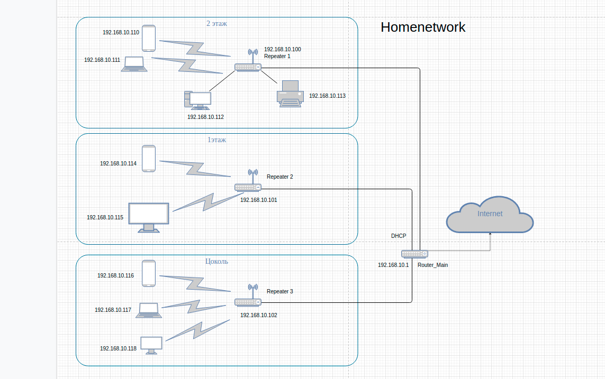

# Домашнее задание к занятию "3.8. Компьютерные сети, лекция 3"

1. Подключитесь к публичному маршрутизатору в интернет. Найдите маршрут к вашему публичному IP 

 `wget -qO- eth0.me`

 >185.54.238.xx

   ```
   telnet route-views.routeviews.org
   Username: rviews
   show ip route 185.54.238.xx
   ```

```
route-views>show ip route 185.54.238.xx
Routing entry for 185.54.238.0/23
  Known via "bgp 6447", distance 20, metric 0
  Tag 3356, type external
  Last update from 4.68.4.46 06:12:46 ago
  Routing Descriptor Blocks:
  * 4.68.4.46, from 4.68.4.46, 06:12:46 ago
      Route metric is 0, traffic share count is 1
      AS Hops 4
      Route tag 3356
      MPLS label: none

```

   ```
   route-views>show ip bgp 185.54.238.xx
BGP routing table entry for 185.54.238.0/23, version 3457475551
Paths: (22 available, best #10, table default)
  Not advertised to any peer
  Refresh Epoch 1
  57866 9002 9049 61031 60245 60245
    37.139.139.17 from 37.139.139.17 (37.139.139.17)
      Origin IGP, metric 0, localpref 100, valid, external
      Community: 9002:0 9002:64667
      path 7FE1887956C8 RPKI State valid
      rx pathid: 0, tx pathid: 0
  Refresh Epoch 1
  53767 174 31133 60245 60245
    162.251.163.2 from 162.251.163.2 (162.251.162.3)
      Origin IGP, localpref 100, valid, external
      Community: 174:21101 174:22005 53767:5000
      path 7FE14B53B778 RPKI State valid
      rx pathid: 0, tx pathid: 0
  Refresh Epoch 1
  3333 31133 60245 60245
    193.0.0.56 from 193.0.0.56 (193.0.0.56)
      Origin IGP, localpref 100, valid, external
      path 7FE09591A078 RPKI State valid
      rx pathid: 0, tx pathid: 0
  Refresh Epoch 1
  1351 6939 20485 60245 60245
    132.198.255.253 from 132.198.255.253 (132.198.255.253)
      Origin IGP, localpref 100, valid, external
      path 7FE0146541D8 RPKI State valid
      rx pathid: 0, tx pathid: 0
  Refresh Epoch 1
  20912 3257 3356 20485 60245 60245
    212.66.96.126 from 212.66.96.126 (212.66.96.126)
      Origin IGP, localpref 100, valid, external
      Community: 3257:8070 3257:30515 3257:50001 3257:53900 3257:53902 20912:65004
      path 7FE11DA6F378 RPKI State valid
      rx pathid: 0, tx pathid: 0
  Refresh Epoch 3
  3303 20485 60245 60245
    217.192.89.50 from 217.192.89.50 (138.187.128.158)
      Origin IGP, localpref 100, valid, external
      Community: 3303:1004 3303:1006 3303:1030 3303:3056 20485:10072
      path 7FE0DD9E0528 RPKI State valid
      rx pathid: 0, tx pathid: 0
  Refresh Epoch 1
  2497 20485 60245 60245
    202.232.0.2 from 202.232.0.2 (58.138.96.254)
      Origin IGP, localpref 100, valid, external
      path 7FE0C165F8D0 RPKI State valid
      rx pathid: 0, tx pathid: 0
  Refresh Epoch 1
  3549 3356 20485 60245 60245
    208.51.134.254 from 208.51.134.254 (67.16.168.191)
      Origin IGP, metric 0, localpref 100, valid, external
      Community: 3356:2 3356:22 3356:100 3356:123 3356:501 3356:901 3356:2065 3549:2581 3549:30840 20485:10072
      path 7FE1420DBA00 RPKI State valid
      rx pathid: 0, tx pathid: 0
  Refresh Epoch 1
  701 3356 20485 60245 60245
    137.39.3.55 from 137.39.3.55 (137.39.3.55)
      Origin IGP, localpref 100, valid, external
      path 7FE0CCEFC290 RPKI State valid
      rx pathid: 0, tx pathid: 0
  Refresh Epoch 1
  3356 20485 60245 60245
    4.68.4.46 from 4.68.4.46 (4.69.184.201)
      Origin IGP, metric 0, localpref 100, valid, external, best
      Community: 3356:2 3356:22 3356:100 3356:123 3356:501 3356:901 3356:2065 20485:10072
      path 7FE0C651C058 RPKI State valid
      rx pathid: 0, tx pathid: 0x0
  Refresh Epoch 1
  1221 4637 31133 60245 60245
    203.62.252.83 from 203.62.252.83 (203.62.252.83)
      Origin IGP, localpref 100, valid, external
      path 7FE04B1ADA78 RPKI State valid
      rx pathid: 0, tx pathid: 0
  Refresh Epoch 1
  19214 174 31133 60245 60245
    208.74.64.40 from 208.74.64.40 (208.74.64.40)
      Origin IGP, localpref 100, valid, external
      Community: 174:21101 174:22005
      path 7FE0123449E0 RPKI State valid
      rx pathid: 0, tx pathid: 0
  Refresh Epoch 1
  101 3491 20485 20485 60245 60245
    209.124.176.223 from 209.124.176.223 (209.124.176.223)
      Origin IGP, localpref 100, valid, external
      Community: 101:20300 101:22100 3491:300 3491:311 3491:9001 3491:9080 3491:9081 3491:9087 3491:62210 3491:62220 20485:10072
      path 7FE0B0F8D6D8 RPKI State valid
      rx pathid: 0, tx pathid: 0
  Refresh Epoch 1
  7018 1299 31133 60245 60245
    12.0.1.63 from 12.0.1.63 (12.0.1.63)
      Origin IGP, localpref 100, valid, external
      Community: 7018:5000 7018:37232
      path 7FE0AF624498 RPKI State valid
      rx pathid: 0, tx pathid: 0
  Refresh Epoch 1
  3561 3910 3356 20485 60245 60245
    206.24.210.80 from 206.24.210.80 (206.24.210.80)
      Origin IGP, localpref 100, valid, external
      path 7FE12335CBE8 RPKI State valid
      rx pathid: 0, tx pathid: 0
  Refresh Epoch 1
  49788 12552 31133 60245 60245
    91.218.184.60 from 91.218.184.60 (91.218.184.60)
      Origin IGP, localpref 100, valid, external
      Community: 12552:12000 12552:12100 12552:12101 12552:22000
      Extended Community: 0x43:100:1
      path 7FE123361EE8 RPKI State valid
      rx pathid: 0, tx pathid: 0
  Refresh Epoch 1
  7660 2516 6762 20485 60245 60245
    203.181.248.168 from 203.181.248.168 (203.181.248.168)
      Origin IGP, localpref 100, valid, external
      Community: 2516:1030 7660:9001
      path 7FE123366B68 RPKI State valid
      rx pathid: 0, tx pathid: 0
  Refresh Epoch 1
  852 31133 60245 60245
    154.11.12.212 from 154.11.12.212 (96.1.209.43)
      Origin IGP, metric 0, localpref 100, valid, external
      path 7FE04A2552A0 RPKI State valid
      rx pathid: 0, tx pathid: 0
  Refresh Epoch 1
  20130 23352 3257 3356 20485 60245 60245
    140.192.8.16 from 140.192.8.16 (140.192.8.16)
      Origin IGP, localpref 100, valid, external
      path 7FE08EDAF648 RPKI State valid
      rx pathid: 0, tx pathid: 0
  Refresh Epoch 1
  3257 3356 20485 60245 60245
    89.149.178.10 from 89.149.178.10 (213.200.83.26)
      Origin IGP, metric 10, localpref 100, valid, external
      Community: 3257:8794 3257:30043 3257:50001 3257:54900 3257:54901
      path 7FE14B7E1068 RPKI State valid
      rx pathid: 0, tx pathid: 0
  Refresh Epoch 1
  6939 20485 60245 60245
    64.71.137.241 from 64.71.137.241 (216.218.252.164)
      Origin IGP, localpref 100, valid, external
      path 7FE14D9BC7E0 RPKI State valid
      rx pathid: 0, tx pathid: 0
  Refresh Epoch 2
  8283 31133 60245 60245
    94.142.247.3 from 94.142.247.3 (94.142.247.3)
      Origin IGP, metric 0, localpref 100, valid, external
      Community: 8283:1 8283:101 8283:103
      unknown transitive attribute: flag 0xE0 type 0x20 length 0x24
        value 0000 205B 0000 0000 0000 0001 0000 205B
              0000 0005 0000 0001 0000 205B 0000 0005
              0000 0003 
      path 7FE175853990 RPKI State valid
      rx pathid: 0, tx pathid: 0

   ```

2. Создайте dummy0 интерфейс в Ubuntu. Добавьте несколько статических маршрутов. Проверьте таблицу маршрутизации. 
*интерфейс dummy0, назначаем адрес 10.1.10.1/24, *

    ```
    $ sudo ip link add dummy0 type dummy
    $ sudo ip add add 10.1.10.1/24 dev dummy0
    $ sudo ip link set dummy0 up
    ```

    *Проверка*

    `$ ip -c -br addr`

    ```
    lo               UNKNOWN        127.0.0.1/8 ::1/128 
    enp2s0           UP             192.168.10.112/24 fe80::e7e7:ca98:188f:74d2/64 
    enp2s0.200@enp2s0 UP             10.0.10.1/24 fe80::96de:80ff:fe12:8611/64 
    dummy0           UNKNOWN        10.1.10.1/24 fe80::f87d:c1ff:fe50:66db/64 

    ```

    `$ ping 10.1.10.1`

    ```
    PING 10.1.10.1 (10.1.10.1) 56(84) bytes of data.
    64 bytes from 10.1.10.1: icmp_seq=1 ttl=64 time=0.045 ms
    64 bytes from 10.1.10.1: icmp_seq=2 ttl=64 time=0.043 ms
    64 bytes from 10.1.10.1: icmp_seq=3 ttl=64 time=0.043 ms
    64 bytes from 10.1.10.1: icmp_seq=4 ttl=64 time=0.044 ms
    64 bytes from 10.1.10.1: icmp_seq=5 ttl=64 time=0.042 ms

    ```

    *Добавим несколько статических маршрутов через интерфейс enp2s0 vlan 200, созданный ранее в работе 3.7*

    ```
    $ sudo ip r add 10.1.20.0/24 via 10.0.10.1
    $ sudo ip r add 10.1.30.0/24 via 10.0.10.1
    $ sudo ip r add 10.1.40.0/24 via 10.0.10.1
    ```

    *Проверяем таблицу маршрутизации*

    `$ ip r`

    ```
    default via 192.168.10.1 dev enp2s0 proto dhcp metric 100 
    10.0.10.0/24 dev enp2s0.200 proto kernel scope link src 10.0.10.1 
    10.1.10.0/24 dev dummy0 proto kernel scope link src 10.1.10.1 
    10.1.20.0/24 via 10.0.10.1 dev enp2s0.200 
    10.1.30.0/24 via 10.0.10.1 dev enp2s0.200 
    10.1.40.0/24 via 10.0.10.1 dev enp2s0.200 

    ```

   
4. Проверьте открытые TCP порты в Ubuntu, какие протоколы и приложения используют эти порты? Приведите несколько примеров.

`sudo ss -ltpnO`

```
  State    Recv-Q   Send-Q          Local Address:Port       Peer Address:Port   Process                                                                        
  LISTEN   0        4096                  0.0.0.0:48851           0.0.0.0:*       users:(("rpc.mountd",pid=862,fd=17))                                          
  LISTEN   0        4096            127.0.0.53%lo:53              0.0.0.0:*       users:(("systemd-resolve",pid=699,fd=13))                                     
  LISTEN   0        5                   127.0.0.1:631             0.0.0.0:*       users:(("cupsd",pid=45610,fd=7))                                              
  LISTEN   0        4096                  0.0.0.0:44095           0.0.0.0:*       users:(("rpc.mountd",pid=862,fd=13))                                          
  LISTEN   0        64                    0.0.0.0:2049            0.0.0.0:*                                                                                     
  LISTEN   0        64                    0.0.0.0:39375           0.0.0.0:*                                                                                     
  LISTEN   0        4096                  0.0.0.0:44271           0.0.0.0:*       users:(("rpc.mountd",pid=862,fd=9))                                           
  LISTEN   0        4096                  0.0.0.0:111             0.0.0.0:*       users:(("rpcbind",pid=698,fd=4),("systemd",pid=1,fd=297))                     
  LISTEN   0        64                       [::]:35379              [::]:*                                                                                     
  LISTEN   0        5                       [::1]:631                [::]:*       users:(("cupsd",pid=45610,fd=6))                                              
  LISTEN   0        4096                     [::]:37239              [::]:*       users:(("rpc.mountd",pid=862,fd=15))                                          
  LISTEN   0        4096                     [::]:49369              [::]:*       users:(("rpc.mountd",pid=862,fd=11))                                          
  LISTEN   0        4096       [::ffff:127.0.0.1]:6942                  *:*       users:(("java",pid=3146,fd=33))                                               
  LISTEN   0        64                       [::]:2049               [::]:*                                                                                     
  LISTEN   0        4096                        *:9100                  *:*       users:(("node_exporter",pid=752,fd=3))                                        
  LISTEN   0        4096       [::ffff:127.0.0.1]:63342                 *:*       users:(("java",pid=3146,fd=63))                                               
  LISTEN   0        4096                     [::]:56079              [::]:*       users:(("rpc.mountd",pid=862,fd=19))                                          
  LISTEN   0        4096                     [::]:111                [::]:*       users:(("rpcbind",pid=698,fd=6),("systemd",pid=1,fd=299))                     
```
 *Прослушиваются порты* 

    - *48851 на  PID 862 systemd-resolve. Протокол  RPC*  
    - *9100 на всех интерфейсах node_exporter PID 752. Протокол RPC*  
    - *111 на всех интерфейсах демон rpcbind PID 615. Протокол RPC*

6. Проверьте используемые UDP сокеты в Ubuntu, какие протоколы и приложения используют эти порты?

```State     Recv-Q    Send-Q       Local Address:Port        Peer Address:Port   Process                                                                        
UNCONN    0         0              224.0.0.251:5353             0.0.0.0:*       users:(("chrome",pid=2127,fd=210))                                            
UNCONN    0         0              224.0.0.251:5353             0.0.0.0:*       users:(("chrome",pid=2127,fd=156))                                            
UNCONN    0         0              224.0.0.251:5353             0.0.0.0:*       users:(("chrome",pid=2127,fd=153))                                            
UNCONN    0         0              224.0.0.251:5353             0.0.0.0:*       users:(("chrome",pid=2646,fd=78))                                             
UNCONN    0         0                  0.0.0.0:5353             0.0.0.0:*       users:(("avahi-daemon",pid=739,fd=12))                                        
UNCONN    0         0                  0.0.0.0:54551            0.0.0.0:*       users:(("rpc.mountd",pid=862,fd=12))                                          
UNCONN    0         0                  0.0.0.0:46506            0.0.0.0:*                                                                                     
UNCONN    0         0            127.0.0.53%lo:53               0.0.0.0:*       users:(("systemd-resolve",pid=699,fd=12))                                     
UNCONN    0         0                  0.0.0.0:111              0.0.0.0:*       users:(("rpcbind",pid=698,fd=5),("systemd",pid=1,fd=298))                     
UNCONN    0         0                  0.0.0.0:631              0.0.0.0:*       users:(("cups-browsed",pid=45611,fd=7))                                       
UNCONN    0         0                  0.0.0.0:50174            0.0.0.0:*       users:(("avahi-daemon",pid=739,fd=14))                                        
UNCONN    0         0                  0.0.0.0:50249            0.0.0.0:*       users:(("rpc.mountd",pid=862,fd=16))                                          
UNCONN    0         0                  0.0.0.0:2049             0.0.0.0:*                                                                                     
UNCONN    0         0                  0.0.0.0:59917            0.0.0.0:*       users:(("rpc.mountd",pid=862,fd=8))                                           
UNCONN    0         0                     [::]:5353                [::]:*       users:(("avahi-daemon",pid=739,fd=13))                                        
UNCONN    0         0                     [::]:111                 [::]:*       users:(("rpcbind",pid=698,fd=7),("systemd",pid=1,fd=300))                     
UNCONN    0         0                     [::]:33726               [::]:*       users:(("rpc.mountd",pid=862,fd=14))                                          
UNCONN    0         0                     [::]:33981               [::]:*                                                                                     
UNCONN    0         0                     [::]:58750               [::]:*       users:(("rpc.mountd",pid=862,fd=10))                                          
UNCONN    0         0                     [::]:2049                [::]:*                                                                                     
UNCONN    0         0                     [::]:35908               [::]:*       users:(("avahi-daemon",pid=739,fd=15))                                        
UNCONN    0         0                     [::]:52428               [::]:*       users:(("rpc.mountd",pid=862,fd=18))                                          
```

8. Используя diagrams.net, создайте L3 диаграмму вашей домашней сети или любой другой сети, с которой вы работали. 

    