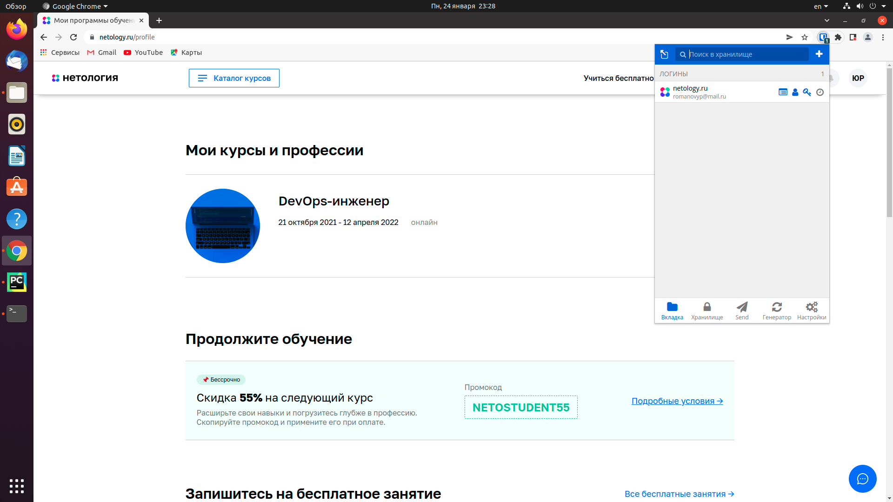
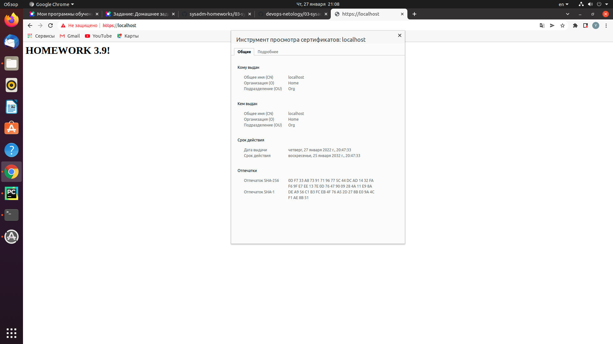
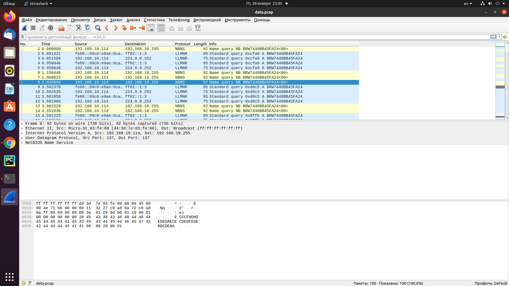

# Домашнее задание к занятию "3.9. Элементы безопасности информационных систем"


1. Установите Bitwarden плагин для браузера. Зарегестрируйтесь и сохраните несколько паролей.



    *Выполнено*

2. Установите Google authenticator на мобильный телефон. Настройте вход в Bitwarden акаунт через Google authenticator OTP.

    *Выполнено*

3. Установите apache2, сгенерируйте самоподписанный сертификат, настройте тестовый сайт для работы по HTTPS.

    
    `$ sudo apt install apache2`

    `$ sudo a2enmod ssl`

    `$ sudo systemctl restart apache2`

    `$ sudo openssl req -x509 -nodes -days 3650 -newkey rsa:2048 -keyout /etc/ssl/private/apache-selfsigned.key -out /etc/ssl/certs/apache-selfsigned.crt -subj "/C=RU/ST=Tyumen/L=Tyumen/O=Home/OU=Org/CN=localhost"`

    `$ sudo nano /etc/apache2/sites-available/localhost.conf`

    ```
    <VirtualHost *:443>
        ServerName localhost
        DocumentRoot /var/www/localhost
        SSLEngine on
        SSLCertificateFile /etc/ssl/certs/apache-selfsigned.crt
        SSLCertificateKeyFile /etc/ssl/private/apache-selfsigned.key
    </VirtualHost>
    ```

    `$ sudo mkdir /var/www/localhost`

    `$ sudo nano /var/www/localhost/index.html`

    ```
    <h1>HOMEWORK3.9!</h1>
    ```

    `$ sudo a2ensite localhost`

    `$ sudo apache2ctl configtest`

    `$ sudo systemctl reload apache2`



4. Проверьте на TLS уязвимости произвольный сайт в интернете (кроме сайтов МВД, ФСБ, МинОбр, НацБанк, РосКосмос, РосАтом, РосНАНО и любых госкомпаний, объектов КИИ, ВПК ... и тому подобное).

    *Проверим только что созданный свой сайт, его точно можно*
```
vagrant@vagrant:~/testssl.sh$ ./testssl.sh -U --sneaky https://localhost

###########################################################
    testssl.sh       3.1dev from https://testssl.sh/dev/
    (93e3b49 2022-01-24 18:05:12 -- )

      This program is free software. Distribution and
             modification under GPLv2 permitted.
      USAGE w/o ANY WARRANTY. USE IT AT YOUR OWN RISK!

       Please file bugs @ https://testssl.sh/bugs/

###########################################################

 Using "OpenSSL 1.0.2-chacha (1.0.2k-dev)" [~183 ciphers]
 on vagrant:./bin/openssl.Linux.x86_64
 (built: "Jan 18 17:12:17 2019", platform: "linux-x86_64")


 Start 2022-01-28 05:54:17        -->> 127.0.0.1:443 (localhost) <<--

 A record via:           /etc/hosts 
 rDNS (127.0.0.1):       --./testssl.sh: connect: Connection refused
./testssl.sh: line 11183: /dev/tcp/127.0.0.1/443: Connection refused
 Oops: TCP connect problem

Unable to open a socket to 127.0.0.1:443. 
Fatal error: Can't connect to "127.0.0.1:443"
Make sure a firewall is not between you and your scanning target!

vagrant@vagrant:~/testssl.sh$ 
vagrant@vagrant:~/testssl.sh$ ./testssl.sh -U --sneaky https://netology.ru

###########################################################
    testssl.sh       3.1dev from https://testssl.sh/dev/
    (93e3b49 2022-01-24 18:05:12 -- )

      This program is free software. Distribution and
             modification under GPLv2 permitted.
      USAGE w/o ANY WARRANTY. USE IT AT YOUR OWN RISK!

       Please file bugs @ https://testssl.sh/bugs/

###########################################################

 Using "OpenSSL 1.0.2-chacha (1.0.2k-dev)" [~183 ciphers]
 on vagrant:./bin/openssl.Linux.x86_64
 (built: "Jan 18 17:12:17 2019", platform: "linux-x86_64")


Testing all IPv4 addresses (port 443): 104.22.41.171 172.67.21.207 104.22.40.171
----------------------------------------------------------
 Start 2022-01-28 05:54:41        -->> 104.22.41.171:443 (netology.ru) <<--

 Further IP addresses:   104.22.40.171 172.67.21.207 2606:4700:10::6816:29ab
                         2606:4700:10::6816:28ab 2606:4700:10::ac43:15cf 
 rDNS (104.22.41.171):   --
 Service detected:       HTTP


 Testing vulnerabilities 

 Heartbleed (CVE-2014-0160)                not vulnerable (OK), no heartbeat extension
 CCS (CVE-2014-0224)                       not vulnerable (OK)
 Ticketbleed (CVE-2016-9244), experiment.  not vulnerable (OK), no session tickets
 ROBOT                                     not vulnerable (OK)
 Secure Renegotiation (RFC 5746)           OpenSSL handshake didn't succeed
 Secure Client-Initiated Renegotiation     not vulnerable (OK)
 CRIME, TLS (CVE-2012-4929)                not vulnerable (OK)
 BREACH (CVE-2013-3587)                    potentially NOT ok, "gzip" HTTP compression detected. - only supplied "/" tested
                                           Can be ignored for static pages or if no secrets in the page
 POODLE, SSL (CVE-2014-3566)               not vulnerable (OK)
 TLS_FALLBACK_SCSV (RFC 7507)              Downgrade attack prevention supported (OK)
 SWEET32 (CVE-2016-2183, CVE-2016-6329)    VULNERABLE, uses 64 bit block ciphers
 FREAK (CVE-2015-0204)                     not vulnerable (OK)
 DROWN (CVE-2016-0800, CVE-2016-0703)      not vulnerable on this host and port (OK)
                                           make sure you don't use this certificate elsewhere with SSLv2 enabled services
                                           https://censys.io/ipv4?q=0E745E5E77A60345EB6E6B33B99A36286C2203D687F3377FBC685B2434518C53 could help you to find out
 LOGJAM (CVE-2015-4000), experimental      not vulnerable (OK): no DH EXPORT ciphers, no DH key detected with <= TLS 1.2
 BEAST (CVE-2011-3389)                     TLS1: ECDHE-RSA-AES128-SHA AES128-SHA
                                                 ECDHE-RSA-AES256-SHA AES256-SHA
                                                 DES-CBC3-SHA 
                                           VULNERABLE -- but also supports higher protocols  TLSv1.1 TLSv1.2 (likely mitigated)
 LUCKY13 (CVE-2013-0169), experimental     potentially VULNERABLE, uses cipher block chaining (CBC) ciphers with TLS. Check patches
 Winshock (CVE-2014-6321), experimental    not vulnerable (OK)
 RC4 (CVE-2013-2566, CVE-2015-2808)        no RC4 ciphers detected (OK)


 Done 2022-01-28 05:56:07 [  89s] -->> 104.22.41.171:443 (netology.ru) <<--

----------------------------------------------------------
 Start 2022-01-28 05:56:08        -->> 172.67.21.207:443 (netology.ru) <<--

 Further IP addresses:   104.22.40.171 104.22.41.171 2606:4700:10::6816:29ab
                         2606:4700:10::6816:28ab 2606:4700:10::ac43:15cf 
 rDNS (172.67.21.207):   --
 Service detected:       HTTP


 Testing vulnerabilities 

 Heartbleed (CVE-2014-0160)                not vulnerable (OK), no heartbeat extension
 CCS (CVE-2014-0224)                       not vulnerable (OK)
 Ticketbleed (CVE-2016-9244), experiment.  not vulnerable (OK), no session tickets
 ROBOT                                     not vulnerable (OK)
 Secure Renegotiation (RFC 5746)           OpenSSL handshake didn't succeed
 Secure Client-Initiated Renegotiation     not vulnerable (OK)
 CRIME, TLS (CVE-2012-4929)                not vulnerable (OK)
 BREACH (CVE-2013-3587)                    potentially NOT ok, "gzip" HTTP compression detected. - only supplied "/" tested
                                           Can be ignored for static pages or if no secrets in the page
 POODLE, SSL (CVE-2014-3566)               not vulnerable (OK)
 TLS_FALLBACK_SCSV (RFC 7507)              Downgrade attack prevention supported (OK)
 SWEET32 (CVE-2016-2183, CVE-2016-6329)    VULNERABLE, uses 64 bit block ciphers
 FREAK (CVE-2015-0204)                     not vulnerable (OK)
 DROWN (CVE-2016-0800, CVE-2016-0703)      not vulnerable on this host and port (OK)
                                           make sure you don't use this certificate elsewhere with SSLv2 enabled services
                                           https://censys.io/ipv4?q=0E745E5E77A60345EB6E6B33B99A36286C2203D687F3377FBC685B2434518C53 could help you to find out
 LOGJAM (CVE-2015-4000), experimental      not vulnerable (OK): no DH EXPORT ciphers, no DH key detected with <= TLS 1.2
 BEAST (CVE-2011-3389)                     TLS1: ECDHE-RSA-AES128-SHA AES128-SHA
                                                 ECDHE-RSA-AES256-SHA AES256-SHA
                                                 DES-CBC3-SHA 
                                           VULNERABLE -- but also supports higher protocols  TLSv1.1 TLSv1.2 (likely mitigated)
 LUCKY13 (CVE-2013-0169), experimental     potentially VULNERABLE, uses cipher block chaining (CBC) ciphers with TLS. Check patches
 Winshock (CVE-2014-6321), experimental    not vulnerable (OK)
 RC4 (CVE-2013-2566, CVE-2015-2808)        no RC4 ciphers detected (OK)


 Done 2022-01-28 05:57:37 [ 179s] -->> 172.67.21.207:443 (netology.ru) <<--

----------------------------------------------------------
 Start 2022-01-28 05:57:38        -->> 104.22.40.171:443 (netology.ru) <<--

 Further IP addresses:   172.67.21.207 104.22.41.171 2606:4700:10::6816:29ab
                         2606:4700:10::6816:28ab 2606:4700:10::ac43:15cf 
 rDNS (104.22.40.171):   --
 Service detected:       HTTP


 Testing vulnerabilities 

 Heartbleed (CVE-2014-0160)                not vulnerable (OK), no heartbeat extension
 CCS (CVE-2014-0224)                       not vulnerable (OK)
 Ticketbleed (CVE-2016-9244), experiment.  not vulnerable (OK), no session tickets
 ROBOT                                     not vulnerable (OK)
 Secure Renegotiation (RFC 5746)           OpenSSL handshake didn't succeed
 Secure Client-Initiated Renegotiation     not vulnerable (OK)
 CRIME, TLS (CVE-2012-4929)                not vulnerable (OK)
 BREACH (CVE-2013-3587)                    potentially NOT ok, "gzip" HTTP compression detected. - only supplied "/" tested
                                           Can be ignored for static pages or if no secrets in the page
 POODLE, SSL (CVE-2014-3566)               not vulnerable (OK)
 TLS_FALLBACK_SCSV (RFC 7507)              Downgrade attack prevention supported (OK)
 SWEET32 (CVE-2016-2183, CVE-2016-6329)    VULNERABLE, uses 64 bit block ciphers
 FREAK (CVE-2015-0204)                     not vulnerable (OK)
 DROWN (CVE-2016-0800, CVE-2016-0703)      not vulnerable on this host and port (OK)
                                           make sure you don't use this certificate elsewhere with SSLv2 enabled services
                                           https://censys.io/ipv4?q=0E745E5E77A60345EB6E6B33B99A36286C2203D687F3377FBC685B2434518C53 could help you to find out
 LOGJAM (CVE-2015-4000), experimental      not vulnerable (OK): no DH EXPORT ciphers, no DH key detected with <= TLS 1.2
 BEAST (CVE-2011-3389)                     TLS1: ECDHE-RSA-AES128-SHA AES128-SHA
                                                 ECDHE-RSA-AES256-SHA AES256-SHA
                                                 DES-CBC3-SHA 
                                           VULNERABLE -- but also supports higher protocols  TLSv1.1 TLSv1.2 (likely mitigated)
 LUCKY13 (CVE-2013-0169), experimental     potentially VULNERABLE, uses cipher block chaining (CBC) ciphers with TLS. Check patches
 Winshock (CVE-2014-6321), experimental    not vulnerable (OK)
 RC4 (CVE-2013-2566, CVE-2015-2808)        no RC4 ciphers detected (OK)


 Done 2022-01-28 05:59:10 [ 272s] -->> 104.22.40.171:443 (netology.ru) <<--

----------------------------------------------------------
Done testing now all IP addresses (on port 443): 104.22.41.171 172.67.21.207 104.22.40.171
```
5. Установите на Ubuntu ssh сервер, сгенерируйте новый приватный ключ. Скопируйте свой публичный ключ на другой сервер. Подключитесь к серверу по SSH-ключу.

    *На сервере*

    `$ sudo apt install openssh-server`

    `$ sudo systemctl status sshd`

    ```
     ssh.service - OpenBSD Secure Shell server
     Loaded: loaded (/lib/systemd/system/ssh.service; enabled; vendor preset: enabled)
     Active: active (running) since Fri 2022-01-28 05:20:48 UTC; 11min ago
       Docs: man:sshd(8)
             man:sshd_config(5)
     Main PID: 688 (sshd)
      Tasks: 1 (limit: 1071)
     Memory: 6.6M
     CGroup: /system.slice/ssh.service
             └─688 sshd: /usr/sbin/sshd -D [listener] 0 of 10-100 startups

     Jan 28 05:20:47 vagrant systemd[1]: Starting OpenBSD Secure Shell server...
     Jan 28 05:20:48 vagrant sshd[688]: Server listening on 0.0.0.0 port 22.
     Jan 28 05:20:48 vagrant sshd[688]: Server listening on :: port 22.
     Jan 28 05:20:48 vagrant systemd[1]: Started OpenBSD Secure Shell server.
     Jan 28 05:20:49 vagrant sshd[740]: Accepted publickey for vagrant from 10.0.2.2 port 34>
     Jan 28 05:20:49 vagrant sshd[740]: pam_unix(sshd:session): session opened for user vagr>
     Jan 28 05:20:56 vagrant sshd[870]: Accepted publickey for vagrant from 10.0.2.2 port 34>
     Jan 28 05:20:56 vagrant sshd[870]: pam_unix(sshd:session): session opened for user vagr>
     Jan 28 05:21:11 vagrant sshd[1143]: Accepted publickey for vagrant from 10.0.2.2 port 3>
     Jan 28 05:21:11 vagrant sshd[1143]: pam_unix(sshd:session): session opened for user vag>

    ```

    *На клиенте*

    `$ ssh-keygen`

    `$ ssh-copy-id rom@192.168.8.105`

    `$ ssh rom@192.168.8.105`

    *Соглашаемся с сохранением ключей сервера, заходим в сессию.*

6. Переименуйте файлы ключей из задания 5. Настройте файл конфигурации SSH клиента, так чтобы вход на удаленный сервер осуществлялся по имени сервера.

   

    ```
    $  mv ~/.ssh/id_rsa ~/.ssh/rommv_rsa
    $ mv ~/.ssh/id_rsa.pub ~/.ssh/rom_rsa.pub
    ```
    
    `$ touch ~/.ssh/config && chmod 600 ~/.ssh/config`

    `$ nano ~/.ssh/config`

    ```
    Host homework3.9
      HostName 192.168.8.105
      IdentityFile ~/.ssh/rom_rsa
      User rom
    ```

    `$ ssh homework3.9`

    >rom@vagrant:~$  

7. Соберите дамп трафика утилитой tcpdump в формате pcap, 100 пакетов. Откройте файл pcap в Wireshark.

    `$sudo tcpdump -w data.pcap -c 100`



 ---
