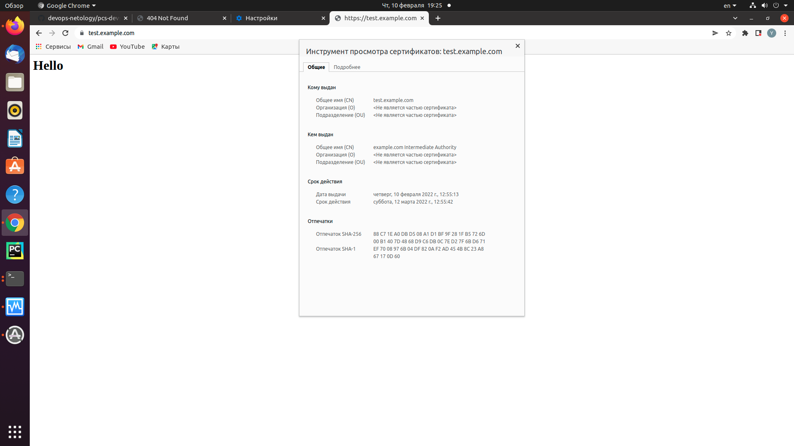
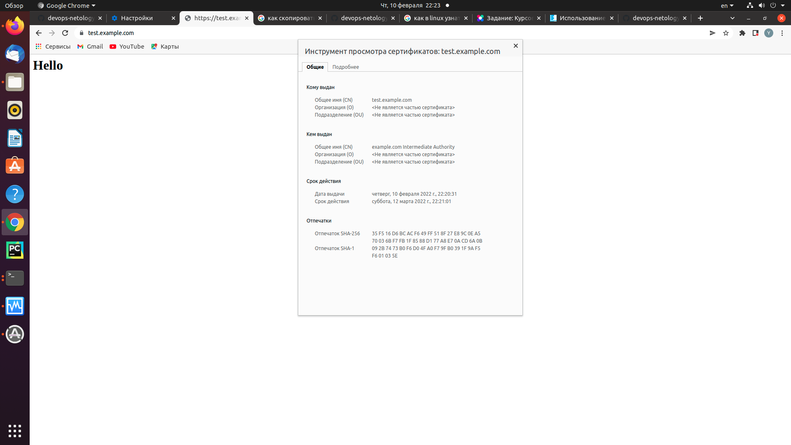

# Курсовая работа по итогам модуля "DevOps и системное администрирование"

## Задание

1. Создайте виртуальную машину Linux.
2. Установите ufw и разрешите к этой машине сессии на порты 22 и 443, при этом трафик на интерфейсе localhost (lo) должен ходить свободно на все порты.
3. Установите hashicorp vault ([инструкция по ссылке](https://learn.hashicorp.com/tutorials/vault/getting-started-install?in=vault/getting-started#install-vault)).
4. Cоздайте центр сертификации по инструкции ([ссылка](https://learn.hashicorp.com/tutorials/vault/pki-engine?in=vault/secrets-management)) и выпустите сертификат для использования его в настройке веб-сервера nginx (срок жизни сертификата - месяц).
5. Установите корневой сертификат созданного центра сертификации в доверенные в хостовой системе.
6. Установите nginx.
7. По инструкции ([ссылка](https://nginx.org/en/docs/http/configuring_https_servers.html)) настройте nginx на https, используя ранее подготовленный сертификат:
  - можно использовать стандартную стартовую страницу nginx для демонстрации работы сервера;
  - можно использовать и другой html файл, сделанный вами;
8. Откройте в браузере на хосте https адрес страницы, которую обслуживает сервер nginx.
9. Создайте скрипт, который будет генерировать новый сертификат в vault:
  - генерируем новый сертификат так, чтобы не переписывать конфиг nginx;
  - перезапускаем nginx для применения нового сертификата.
10. Поместите скрипт в crontab, чтобы сертификат обновлялся какого-то числа каждого месяца в удобное для вас время.

## Результат

- Запускаем и конектимся к VM  с Linux

`vagrant up`

`vagrant ssh` 

- Процесс установки и настройки ufw

`sudo apt install ufw`

`Sudo ufw disable`

`sudo ufw default deny incoming`

`sudo ufw default allow outgoing`

`sudo ufw allow 22`

`sudo ufw allow 443`

`sudo ufw allow in on lo`

`sudo ufw allow 2222` 

*добавим порт 2222 для доступа к VM по SSH*

`sudo ufw enable`

`sudo ufw status verbose`

```
Status: active
Logging: on (low)
Default: deny (incoming), allow (outgoing), disabled (routed)
New profiles: skip

To                         Action      From
--                         ------      ----
22                         ALLOW IN    Anywhere                  
443                        ALLOW IN    Anywhere                  
Anywhere on lo             ALLOW IN    Anywhere                  
2222                       ALLOW IN    Anywhere                  
22 (v6)                    ALLOW IN    Anywhere (v6)             
443 (v6)                   ALLOW IN    Anywhere (v6)             
Anywhere (v6) on lo        ALLOW IN    Anywhere (v6)             
2222 (v6)                  ALLOW IN    Anywhere (v6)             

```
- Процесс установки и выпуска сертификата с помощью hashicorp vault

*Установка*

`curl -fsSL https://apt.releases.hashicorp.com/gpg | sudo apt-key add -`

`sudo apt-add-repository "deb [arch=amd64] https://apt.releases.hashicorp.com $(lsb_release -cs) main"`

`sudo apt-get update && sudo apt-get install vault`

*Установка утилиты для работы с JSON*

`sudo apt-get install jq`

*В данной работе VAULT запускаем на локальной машине и обращаемся по HTTP, для этого в файле  /etc/vault.d/vault.hcl раскоментим и закоментим настройки  HTTPS*

```
# HTTP listener
listener "tcp" {
  address = "127.0.0.1:8200"
  tls_disable = 1
}
```
*Для сохранения результатов запустим  VAULT как демон*

`sudo systemctl enable vault`

`sudo systemctl start vault`

*Первоначальная настройка VAULT*

`export VAULT_ADDR='http://127.0.0.1:8200'`

`vault operator init`

```
 vagrant@vagrant:~$ export VAULT_ADDR='http://127.0.0.1:8200'
 vagrant@vagrant:~$ vault operator init
 Unseal Key 1: Quw9HKIg8a8qPvLtmct9xE5bPGbd5uBtxWP+BLT/XisW
 Unseal Key 2: uH9MV5ut/6rOBVZPbOBMiRKxFXuJvkDJjNAL3Q++8Lv0
 Unseal Key 3: aitEtG5YqJVMBUAwUlGNOvHU6c3i7q9x+ivm0uSdfG8U
 Unseal Key 4: drQqRvHs4E2ltMP0POWxHFOp1nv3IAnBPBx8tz4FLs3x
 Unseal Key 5: rSiAZjrKYtw37r4n2TnW/2Z9Ucmj0kPjxZLcfiNfxWsK

 Initial Root Token: s.OW6ObreC0VUIenmBdFQ7vLKp
```
*Переведем в режим unseal*

```
  vagrant@vagrant:/$ vault operator unseal
  Unseal Key (will be hidden): 
  Key                Value
  ---                -----
  Seal Type          shamir
  Initialized        true
  Sealed             true
  Total Shares       5
  Threshold          3
  Unseal Progress    1/3
  Unseal Nonce       552acaa3-9b19-c685-89b7-8483b778f69e
  Version            1.9.3
  Storage Type       file
  HA Enabled         false
  vagrant@vagrant:/$ vault operator unseal 
  Unseal Key (will be hidden): 
  Key                Value
  ---                -----
  Seal Type          shamir
  Initialized        true
  Sealed             true
  Total Shares       5
  Threshold          3
  Unseal Progress    2/3
  Unseal Nonce       552acaa3-9b19-c685-89b7-8483b778f69e
  Version            1.9.3
  Storage Type       file
  HA Enabled         false
  vagrant@vagrant:/$ vault operator unseal 
  Unseal Key (will be hidden): 
  Key             Value
  ---             -----
  Seal Type       shamir
  Initialized     true
  Sealed          false
  Total Shares    5
  Threshold       3
  Version         1.9.3
  Storage Type    file
  Cluster Name    vault-cluster-438470fc
  Cluster ID      c975d6cd-6948-6d4b-8bb6-5b9147a1dee6
  HA Enabled      false


```

`vault login <ROOTTOKEN>`

*Настраиваем VAULT для работы с инфраструктурой PKI и генерируем корневой сертификат*

`vault secrets enable pki`

`vault secrets tune -max-lease-ttl=87600h pki`

`vault write -field=certificate pki/root/generate/internal common_name="example.com" ttl=87600h > CA_cert.crt`

`vault write pki/config/urls issuing_certificates="$VAULT_ADDR/v1/pki/ca" crl_distribution_points="$VAULT_ADDR/v1/pki/crl"`

*Устанавливаем корневой сертификат на клиента*

*Генерируем промежуточный сертификат*

`vault secrets enable -path=pki_int pki`

`vault secrets tune -max-lease-ttl=43800h pki_int`

`vault write -format=json pki_int/intermediate/generate/internal common_name="example.com Intermediate Authority" | jq -r '.data.csr' > pki_intermediate.csr`

`vault write -format=json pki/root/sign-intermediate csr=@pki_intermediate.csr format=pem_bundle ttl="43800h" | jq -r '.data.certificate' > intermediate.cert.pem`

`vault write pki_int/intermediate/set-signed certificate=@intermediate.cert.pem`

*Создаем роль*

`vault write pki_int/roles/example-dot-com allowed_domains="example.com" allow_subdomains=true allow_bare_domains=true max_ttl="720h"`

*Генерируем сертификат для сайта test.example.com выгружаем в формате JSON*

`vault write -format=json pki_int/issue/example-dot-com common_name="test.example.com" ttl="720h" > test.example.com.crt.json`

*Создаем файлы, необходимые для работы nginx*

`cat test.example.com.crt.json | jq -r '.data.certificate' > test.example.com.pem`

`cat test.example.com.crt.json | jq -r '.data.ca_chain[]' >> test.example.com.pem`

`cat test.example.com.crt.json | jq -r '.data.private_key' > test.example.com.key`

- Процесс установки и настройки сервера nginx

`sudo apt install nginx`

*Изменяем файл конфигурации для работы с сертификатами *

```
server {
    listen              443 ssl;
    server_name         test.example.com;
    ssl_certificate     ssl/test.example.com.pem;
    ssl_certificate_key ssl/test.example.com.key;
    ssl_protocols       TLSv1 TLSv1.1 TLSv1.2;
    ssl_ciphers         HIGH:!aNULL:!MD5;
    root /var/www/test.example.com;
    index index.html;
    location / {
        try_files $uri $uri/ =404;
    }
}
```

*Создаем файл index.html или берем дефолтный*

*Копируем сгенерированные файлы сертификата и ключа в каталог /etc/nginx/ssl*

*Ставим NGINX в автозагрузку и делаем рестарт*

`systemctl enable nginx`

`systemctl restart nginx`

- Страница сервера nginx в браузере хоста не содержит предупреждений 




*Создаем  скрипт для генерации сертификата. В данном примере предположим что vault в режиме unseal*

```


#!/usr/bin/env bash

# Переменная для места хранения сертификатов
CERTPATH="/etc/nginx/ssl"

#Переменная для места хранения ключей и токена  vault 
KEYSF="/etc/nginx/ssl/keys"

#Переменная для TTL сертификата
TTLCERT="720h"

#Имя сайта вводимое первым аргументом
SITENAME=$1

export VAULT_ADDR="http://127.0.0.1:8200"
unset VAULT_TOKEN

if [[ $SITENAME = "" ]]
then
    echo 'Need 1 arg with site DNS name'; exit 1
fi

if [[ $(vault status -format=json | jq -r '.initialized') != true ]]
then
    echo 'Error: Vault not initialized'; exit 1
fi

if [[ $(vault status -format=json | jq -r '.sealed') == true ]]
then
    UNSKEY1=$(grep "Key 1:" $KEYSF | awk '{print $4}')
    UNSKEY2=$(grep "Key 2:" $KEYSF | awk '{print $4}')
    UNSKEY3=$(grep "Key 3:" $KEYSF | awk '{print $4}')

    RTOKEN=$(grep "Root Token:" $KEYSF | awk '{print $4}')

    vault operator unseal $UNSKEY1 > /dev/null
    vault operator unseal $UNSKEY2 > /dev/null
    vault operator unseal $UNSKEY3 > /dev/null
    vault login $RTOKEN > /dev/null

fi

if [[ $(vault status -format=json | jq -r '.sealed') == true ]]
then
    echo 'Error: Vault sealed, cant unseal'; exit 1
else
    vault write -format=json pki_int/issue/example-dot-com common_name=$SITENAME ttl=$TTLCERT > $CERTPATH/$SITENAME.json
    
    if [[ $(cat $CERTPATH/$SITENAME.json | jq -r '.warnings' ) != null ]]
    then
    echo 'Error: Cant generate certificate request'; exit 1
    fi

    cat $CERTPATH/$SITENAME.json | jq -r '.data.certificate' > $CERTPATH/$SITENAME.pem
    cat $CERTPATH/$SITENAME.json | jq -r '.data.ca_chain[]' >> $CERTPATH/$SITENAME.pem
    cat $CERTPATH/$SITENAME.json | jq -r '.data.private_key' > $CERTPATH/$SITENAME.key

    chown www-data:www-data {$CERTPATH/$SITENAME.json,$CERTPATH/$SITENAME.pem,$CERTPATH/$SITENAME.key}
    chmod 0400 {$CERTPATH/$SITENAME.json,$CERTPATH/$SITENAME.pem,$CERTPATH/$SITENAME.key}

    systemctl stop nginx
    systemctl start nginx

    if [[ $? != 0 ]]; then echo 'Error: starting NGINX'; exit 1; fi

    echo 'New certificate for '$SITENAME' generated. NGINX restarted.'
fi


```

*Редактируем crontab для root*

`crontab -e`

*Создаем запись для запуска скрипта генереции сертификата в 17:21 10.02 UTC*

`21 17 10 2 *	/etc/nginx/ssl/testcert test.example.com`

*проверяем по логу*

`tail -5 /var/log/syslog`

```
Feb 10 17:21:01 vagrant systemd[1]: nginx.service: Succeeded.
Feb 10 17:21:01 vagrant systemd[1]: Stopped A high performance web server and a reverse proxy server.
Feb 10 17:21:01 vagrant systemd[1]: Starting A high performance web server and a reverse proxy server...
Feb 10 17:21:01 vagrant systemd[1]: Started A high performance web server and a reverse proxy server.

```




